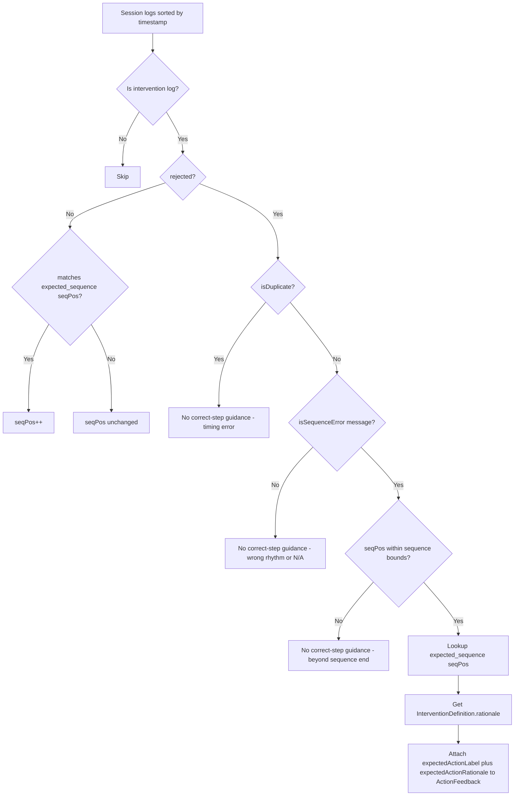
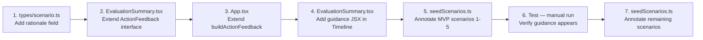

# Implementation Plan: Correct Step Guidance in Post-Scenario Debrief

> **Status:** Draft — awaiting approval  
> **Scope:** Post-Scenario Debrief (`EvaluationSummary`) — incorrect action cards  
> **Branch suggestion:** `feat/debrief-correct-step`

---

## Table of Contents

1. [Problem Statement](#1-problem-statement)
2. [Key Findings from Codebase Audit](#2-key-findings-from-codebase-audit)
3. [Data Model Changes](#3-data-model-changes)
4. [Seed Data Changes](#4-seed-data-changes)
5. [Sequence Resolution Algorithm](#5-sequence-resolution-algorithm)
6. [Logic Changes — `buildActionFeedback()`](#6-logic-changes--buildactionfeedback)
7. [UI Changes — Timeline Incorrect Card](#7-ui-changes--timeline-incorrect-card)
8. [Edge Cases](#8-edge-cases)
9. [Implementation Order & Files to Change](#9-implementation-order--files-to-change)
10. [Architecture Decision Log](#10-architecture-decision-log)

---

## 1. Problem Statement

When a learner performs an incorrect action in a scenario, the Post-Scenario Debrief timeline marks it red with a generic "Protocol Deviation: Incorrect sequence" message. The learner cannot tell:

- **Which action they should have performed** at that specific position in the protocol sequence.
- **Why** that action is the correct one clinically.

This plan adds a "Correct step" disclosure panel to each incorrect action card in the timeline, showing the expected intervention name and a 1–2 sentence AHA-cited clinical rationale.

---

## 2. Key Findings from Codebase Audit

### 2.1 Rejection message taxonomy (from `useScenarioEngine.ts`)

The engine produces four categories of rejection, distinguishable by `details.message`:

| Category | Message prefix | `isDuplicate?` | Needs correct-step guidance? |
|---|---|---|---|
| Sequence error | `"Protocol Deviation: Incorrect sequence"` | `false` | **YES** |
| Not applicable | `"Protocol Deviation: This action is not applicable"` | `false` | No — no sequence position to reference |
| Wrong rhythm | `"Cannot perform: requires"` | `false` | No — conditional on patient state |
| Cooldown/already active | `"Already in progress"` or `"Already applied"` | `true` | No — timing error, not selection error |

The `isDuplicate` flag in `buildActionFeedback()` (`App.tsx:300-303`) detects cooldown rejections by checking `message.startsWith('Already')`. This existing flag already handles the amber-vs-red distinction.

### 2.2 Sequence position is not persisted in logs

The engine stores `sequenceIndex` in reducer state, but **does not write it to the session log**. The `SessionLogEvent.details` for an intervention only carries `{ intervention_id, message, rejected }`. Therefore, to determine "what was the correct action at this rejection point?", the sequence position must be **re-derived** by replaying the log in `buildActionFeedback()`.

### 2.3 `expected_sequence` already exists on `Scenario`

`Scenario.expected_sequence?: string[]` (`scenario.ts:98`) is the source of truth. All production scenarios in `seedScenarios.ts` define it. This array drives the engine's `sequenceIndex` check.

### 2.4 `buildActionFeedback()` does not receive the Scenario

Currently (`App.tsx:298`):
```ts
function buildActionFeedback(logs: SessionLogEvent[]): ActionFeedback[]
```
It is called at `App.tsx:478`:
```ts
setEvalActions(buildActionFeedback(logs));
```
At that call site, `activeScenario` is still in state (used at line 639 for `conclusion`). Passing `activeScenario` to `buildActionFeedback` is straightforward.

### 2.5 `InterventionDefinition` has no `rationale` field

The `InterventionDefinition` interface (`scenario.ts:45-53`) carries engine-only fields. A new optional `rationale?: string` field must be added to hold the clinical justification text per-intervention.

---

## 3. Data Model Changes

### 3.1 `InterventionDefinition` — add `rationale`

**File:** `src/types/scenario.ts`

**Before:**
```ts
export interface InterventionDefinition {
  duration_sec?: number;
  priority?: number;
  rate_modifiers?: RateModifier[];
  state_overrides?: Partial<PatientState>;
  requires_rhythm?: HeartRhythm[];
  success_chance?: number;
  success_state?: Partial<PatientState>;
}
```

**After:**
```ts
export interface InterventionDefinition {
  duration_sec?: number;
  priority?: number;
  rate_modifiers?: RateModifier[];
  state_overrides?: Partial<PatientState>;
  requires_rhythm?: HeartRhythm[];
  success_chance?: number;
  success_state?: Partial<PatientState>;
  /** Clinical justification for why this intervention is performed at this step.
   *  1–2 sentences citing AHA guidelines. Shown in Post-Scenario Debrief. */
  rationale?: string;
}
```

This is a non-breaking additive change — all existing scenarios without `rationale` continue to work.

### 3.2 `ActionFeedback` — add `expectedActionLabel` and `expectedActionRationale`

**File:** `src/components/EvaluationSummary.tsx`

**Before:**
```ts
export interface ActionFeedback {
  id: string;
  name: string;
  isCorrect: boolean;
  comment: string;
  timestamp: string;
  reviewId?: string;
  isDuplicate?: boolean;
}
```

**After:**
```ts
export interface ActionFeedback {
  id: string;
  name: string;
  isCorrect: boolean;
  comment: string;
  timestamp: string;
  reviewId?: string;
  isDuplicate?: boolean;
  /** Human-readable label of the intervention expected at this sequence position. */
  expectedActionLabel?: string;
  /** Clinical rationale from InterventionDefinition.rationale for the expected action. */
  expectedActionRationale?: string;
}
```

Both fields are optional so the interface degrades gracefully when:
- The scenario has no `expected_sequence`
- The expected intervention's `InterventionDefinition` has no `rationale`
- The rejection is not a sequence error (e.g. cooldown, wrong rhythm)

---

## 4. Seed Data Changes

### 4.1 Strategy

Add `rationale` to each `InterventionDefinition` entry that appears in any scenario's `expected_sequence`. Interventions that are never in a sequence (e.g. `rescue_breathing` in a scenario where it's a supplementary option) do not need rationale added — the UI degrades gracefully.

The `rationale` text should be authored and maintained directly on the matching `InterventionDefinition` entries in `src/data/seedScenarios.ts`, which is the canonical source of truth for BLS protocol sequencing and debrief rationale. Duplicate scenario-reference markdown should not be maintained. Runtime behavior and tests should read and validate the canonical scenario data directly, with source-of-truth invariants covered in `src/data/seedScenarios.test.ts`.

### 4.2 Worked example — `adult_vfib_arrest_witnessed`

**File:** `src/data/seedScenarios.ts`

Current `expected_sequence`: `['defibrillate', 'cpr', 'epinephrine_1mg', 'amiodarone_300mg']`

```ts
// Before — interventions block (abbreviated)
interventions: {
  cpr: {
    duration_sec: 120,
    priority: 10,
    state_overrides: { bp: '60/20', spo2: 85 },
  },
  defibrillate: {
    duration_sec: 10,
    priority: 100,
    requires_rhythm: ['VFib', 'VTach'],
    success_chance: 0.6,
    success_state: { rhythm: 'Sinus', hr: 85, bp: '110/70', spo2: 92, rr: 12, pulsePresent: true },
  },
  epinephrine_1mg: {
    duration_sec: 240,
    priority: 5,
    success_chance: 0.1,
    success_state: { rhythm: 'Sinus', hr: 110, bp: '90/50', rr: 10, pulsePresent: true },
  },
  amiodarone_300mg: {
    duration_sec: 600,
    priority: 6,
    success_chance: 0.4,
  },
  // ...
},
```

```ts
// After — interventions block with rationale added
interventions: {
  cpr: {
    duration_sec: 120,
    priority: 10,
    state_overrides: { bp: '60/20', spo2: 85 },
    rationale: 'High-quality chest compressions at 100–120/min maintain coronary and cerebral perfusion pressure, increasing the likelihood of successful defibrillation by sustaining myocardial viability per AHA 2020 guidelines.',
  },
  defibrillate: {
    duration_sec: 10,
    priority: 100,
    requires_rhythm: ['VFib', 'VTach'],
    success_chance: 0.6,
    success_state: { rhythm: 'Sinus', hr: 85, bp: '110/70', spo2: 92, rr: 12, pulsePresent: true },
    rationale: 'Early defibrillation is the only definitive treatment for shockable rhythms (VFib/pulseless VTach); each minute of delay reduces survival by 7–10% per AHA 2020 Chain of Survival guidelines.',
  },
  epinephrine_1mg: {
    duration_sec: 240,
    priority: 5,
    success_chance: 0.1,
    success_state: { rhythm: 'Sinus', hr: 110, bp: '90/50', rr: 10, pulsePresent: true },
    rationale: 'Epinephrine 1 mg IV/IO every 3–5 minutes increases coronary and cerebral perfusion pressure via alpha-1 vasoconstriction, improving the likelihood of ROSC in non-shockable and refractory arrest per AHA 2020 ACLS guidelines.',
  },
  amiodarone_300mg: {
    duration_sec: 600,
    priority: 6,
    success_chance: 0.4,
    rationale: 'Amiodarone 300 mg IV/IO is the first-line antiarrhythmic for shock-refractory VFib/pVT; it stabilises the myocardium and reduces recurrence of ventricular fibrillation after defibrillation per AHA 2020 ACLS guidelines.',
  },
  rescue_breathing: {
    duration_sec: 60,
    priority: 8,
    state_overrides: { spo2: 95 },
    // No rationale needed — not in expected_sequence for this scenario
  },
},
```

### 4.3 Scale of seed data changes

With ~20+ scenarios in `seedScenarios.ts`, a full annotation pass would touch every `InterventionDefinition` that appears in any scenario's `expected_sequence`. The implementation can proceed incrementally:

- **Phase 1 (MVP):** Annotate the 4 ACLS cardiac arrest scenarios (scenarios 1–5) — highest traffic scenarios.
- **Phase 2:** Annotate all BLS scenarios, opioid, and pediatric scenarios.

The UI degrades gracefully when `rationale` is absent — no breaking change.

---

## 5. Sequence Resolution Algorithm

### 5.1 Problem

Given the session log (ordered by `timestamp`), we need to know: *at the moment each rejected intervention was attempted, what was the current `sequenceIndex`?*

The engine advances `sequenceIndex` only on **accepted** interventions that match `expected_sequence[sequenceIndex]`. Rejected actions do not advance it.

### 5.2 Algorithm (replay approach)

```
function resolveExpectedActions(
  logs: SessionLogEvent[],
  scenario: Scenario
): Map<logId, { expectedId: string, expectedLabel: string, expectedRationale: string | undefined }>

  sequence = scenario.expected_sequence ?? []
  seqPos = 0
  result = new Map()

  for each log in interventionLogs (sorted by timestamp ascending):
    if log.details.rejected === false:
      // Accepted action — advance seqPos if it matched the current position
      if seqPos < sequence.length AND sequence[seqPos] === log.details.intervention_id:
        seqPos++

    else if log.details.rejected === true AND NOT isDuplicate(log):
      // Check if this is a sequence error (vs wrong-rhythm or not-applicable)
      if isSequenceError(log.details.message) AND seqPos < sequence.length:
        expectedId = sequence[seqPos]
        expectedDef = scenario.interventions[expectedId]
        result.set(log.id, {
          expectedId,
          expectedLabel: prettifyInterventionId(expectedId),
          expectedRationale: expectedDef?.rationale
        })
      // seqPos does NOT advance on rejection

  return result
```

### 5.3 `isSequenceError()` helper

```ts
function isSequenceError(message: string): boolean {
  return message.startsWith('Protocol Deviation: Incorrect sequence');
}
```

This precisely targets the message produced at `useScenarioEngine.ts:432`. The other rejection categories (`"Protocol Deviation: This action is not applicable"`, `"Cannot perform: requires"`) do not produce a sequence position match, so they correctly receive no `expectedActionLabel`.

### 5.4 Why replay is correct

The replay algorithm is exact because:

1. The engine's `sequenceIndex` logic is deterministic: it advances by 1 each time an accepted action matches `expected_sequence[sequenceIndex]` (`useScenarioEngine.ts:498-501`).
2. The session log is persisted in `timestamp` order (Dexie `.sortBy('timestamp')` at `App.tsx:476`).
3. The replay only needs the ordered intervention logs — no other state is required.

### 5.5 Flow diagram



---

## 6. Logic Changes — `buildActionFeedback()`

### 6.1 Updated function signature

**File:** `src/App.tsx`

**Before:**
```ts
function buildActionFeedback(logs: SessionLogEvent[]): ActionFeedback[]
```

**After:**
```ts
function buildActionFeedback(
  logs: SessionLogEvent[],
  scenario: Scenario | null,
): ActionFeedback[]
```

### 6.2 Full updated implementation

```ts
function isSequenceError(message: string): boolean {
  return message.startsWith('Protocol Deviation: Incorrect sequence');
}

function buildActionFeedback(
  logs: SessionLogEvent[],
  scenario: Scenario | null,
): ActionFeedback[] {
  const interventionLogs = logs.filter(isInterventionLog);
  const sequence = scenario?.expected_sequence ?? [];

  // Replay pass: compute expected action at each rejected step
  let seqPos = 0;
  const expectedMap = new Map<string, { label: string; rationale: string | undefined }>();

  for (const log of interventionLogs) {
    const logId = log.id?.toString() ?? `${log.session_id}-${log.timestamp}`;
    const isDuplicateMsg =
      log.details.rejected === true &&
      typeof log.details.message === 'string' &&
      log.details.message.startsWith('Already');

    if (!log.details.rejected) {
      // Accepted — advance seqPos if this action matched the expected step
      if (seqPos < sequence.length && sequence[seqPos] === log.details.intervention_id) {
        seqPos++;
      }
    } else if (!isDuplicateMsg && isSequenceError(log.details.message ?? '')) {
      // Sequence error — record what should have been done
      if (seqPos < sequence.length) {
        const expectedId = sequence[seqPos];
        const expectedDef = scenario?.interventions[expectedId];
        expectedMap.set(logId, {
          label: prettifyInterventionId(expectedId),
          rationale: expectedDef?.rationale,
        });
      }
      // seqPos does NOT advance on rejection
    }
  }

  // Map pass: construct ActionFeedback array
  return interventionLogs.map((log) => {
    const logId = log.id?.toString() ?? `${log.session_id}-${log.timestamp}`;
    const isDuplicate =
      log.details.rejected === true &&
      typeof log.details.message === 'string' &&
      log.details.message.startsWith('Already');

    const expected = expectedMap.get(logId);

    return {
      id: logId,
      name: prettifyInterventionId(log.details.intervention_id),
      isCorrect: !log.details.rejected,
      comment: log.details.message,
      timestamp: formatTimestamp(log.sim_time_sec),
      reviewId: log.details.rejected && !isDuplicate ? log.details.intervention_id : undefined,
      ...(isDuplicate ? { isDuplicate: true } : {}),
      ...(expected ? {
        expectedActionLabel: expected.label,
        ...(expected.rationale ? { expectedActionRationale: expected.rationale } : {}),
      } : {}),
    };
  });
}
```

### 6.3 Update call site in `App.tsx`

**Before (App.tsx ~line 478):**
```ts
setEvalActions(buildActionFeedback(logs));
```

**After:**
```ts
setEvalActions(buildActionFeedback(logs, activeScenario));
```

Note: `activeScenario` is still in scope at this call site (the scenario is only cleared when `onReturnToLibrary` is called, which happens after the summary is dismissed).

---

## 7. UI Changes — Timeline Incorrect Card

### 7.1 Where to insert

**File:** `src/components/EvaluationSummary.tsx`  
**Component:** `Timeline` (line 87) → inside the `.map()` at line 106, within the "Event Content" card block, after the existing `!action.isCorrect && !action.isDuplicate && action.reviewId` button (line 158–167).

### 7.2 JSX for the "Correct step" disclosure panel

Insert this block immediately **after** the `Review Protocol` button block:

```tsx
{/* Correct-step guidance — only for sequence errors with known expected action */}
{!action.isCorrect && !action.isDuplicate && action.expectedActionLabel && (
  <div className="mt-3 pt-3 border-t border-red-100">
    <div className="flex items-start gap-2">
      <div className="shrink-0 mt-0.5 text-amber-500">
        <Lightbulb size={14} />
      </div>
      <div className="flex-1 min-w-0">
        <p className="text-[10px] font-black text-amber-600 uppercase tracking-widest mb-0.5">
          Correct step:
        </p>
        <p className="text-xs font-bold text-slate-800 leading-snug mb-1">
          {action.expectedActionLabel}
        </p>
        {action.expectedActionRationale && (
          <p className="text-xs text-slate-500 leading-relaxed">
            {action.expectedActionRationale}
          </p>
        )}
      </div>
    </div>
  </div>
)}
```

### 7.3 Lucide icon import

Add `Lightbulb` to the existing import on line 2 of `EvaluationSummary.tsx`:

**Before:**
```ts
import { CheckCircle2, AlertCircle, AlertTriangle, ArrowLeft, RefreshCcw, ExternalLink, Clock, Info, Trophy, Target, Star, Activity, BookOpen } from 'lucide-react';
```

**After:**
```ts
import { CheckCircle2, AlertCircle, AlertTriangle, ArrowLeft, RefreshCcw, ExternalLink, Clock, Info, Trophy, Target, Star, Activity, BookOpen, Lightbulb } from 'lucide-react';
```

### 7.4 Visual anatomy of the updated incorrect action card

```
┌─────────────────────────────────────────────────────────────┐
│  🔴 Epinephrine 1mg IV/IO                          ⚠ [icon]  │  ← red header
│                                                              │
│  Protocol Deviation: Incorrect sequence. The next           │  ← red comment text
│  expected step is: Defibrillate.                            │
│                                                              │
│  ⎡ Review Protocol ↗ ⎤                                      │  ← existing button
│                                                              │
│  ─────────────────────────────────────────────────────────  │  ← border-t red-100
│  💡 CORRECT STEP:                                            │  ← amber label
│     Defibrillate (AED/Manual)                               │  ← bold slate-800
│     Early defibrillation is the only definitive treatment   │  ← text-xs slate-500
│     for shockable rhythms; each minute of delay reduces     │
│     survival by 7–10% per AHA 2020 guidelines.             │
└─────────────────────────────────────────────────────────────┘
```

### 7.5 Styling rationale

| Element | Tailwind classes | Rationale |
|---|---|---|
| Panel separator | `border-t border-red-100` | Stays within the red card's colour language |
| Icon | `text-amber-500` | Amber signals "guidance/learning" vs red "error" |
| Label | `text-[10px] font-black text-amber-600 uppercase tracking-widest` | Matches existing micro-label style (e.g. `reviewId` button) |
| Action name | `text-xs font-bold text-slate-800 leading-snug` | High contrast, matches `action.name` heading weight |
| Rationale | `text-xs text-slate-500 leading-relaxed` | Subdued, readable — matches existing `comment` text style |

---

## 8. Edge Cases

### 8.1 Scenario has no `expected_sequence`

`Scenario.expected_sequence` is `string[] | undefined`. When absent:
- `sequence` defaults to `[]` in `buildActionFeedback()`
- `seqPos < sequence.length` is always `false`
- `expectedMap` remains empty
- All `ActionFeedback` entries have no `expectedActionLabel`
- The UI renders the existing red card without the guidance panel

**No special handling required** — the optional chaining already covers this.

### 8.2 `InterventionDefinition` has no `rationale`

When `scenario.interventions[expectedId]?.rationale` is `undefined`:
- `expectedActionLabel` is still populated (the pretty-printed name is derived from `prettifyInterventionId()`)
- `expectedActionRationale` is omitted from the `ActionFeedback` object
- The UI renders the "Correct step:" label + action name, but skips the rationale paragraph

**Graceful degradation** — learners still see the correct action name, just without clinical context.

### 8.3 User performs extra actions beyond the expected sequence length

When `seqPos >= sequence.length`:
- `isSequenceError()` may still be `true` (engine only checks `sequenceIndex < sequence.length` before comparing — see `useScenarioEngine.ts:415`)
- But `seqPos < sequence.length` guard in the replay algorithm returns early with no expected action
- Result: `expectedActionLabel` is absent; the card renders as a plain red rejection without guidance

This is correct behaviour — there is no defined "next expected step" once the sequence is exhausted.

### 8.4 Same intervention appears multiple times in `expected_sequence`

If a scenario defines e.g. `['cpr', 'defibrillate', 'cpr', 'epinephrine_1mg']` (cyclic CPR), the replay algorithm handles this correctly because `seqPos` advances monotonically and `sequence[seqPos]` references the current position, not the first occurrence.

### 8.5 Duplicate/cooldown rejection while a sequence error is pending

Cooldown rejections (`isDuplicate = true`) do not advance `seqPos` and do not get `expectedActionLabel`. The `seqPos` counter is unaffected — the next sequence-error rejection will still correctly reference `sequence[seqPos]`. This is correct because cooldown errors are timing errors, not selection errors.

### 8.6 Rejection type is "not applicable" or "wrong rhythm"

These messages do not match `isSequenceError()` predicate. They receive no `expectedActionLabel`. The UI renders a plain red card (existing behaviour). This is correct because:
- "Not applicable" means the action isn't in this scenario's intervention set at all — there's no meaningful alternative to show
- "Wrong rhythm" means the action is valid in principle but the patient state doesn't support it — the expected action at the current `seqPos` might be misleading

---

## 9. Implementation Order & Files to Change

### 9.1 Files to change

| # | File | Change type | Approximate lines |
|---|---|---|---|
| 1 | `src/types/scenario.ts` | Add `rationale?: string` to `InterventionDefinition` | +3 lines |
| 2 | `src/components/EvaluationSummary.tsx` | Add fields to `ActionFeedback` interface; add `Lightbulb` import; add guidance JSX in `Timeline` | +25 lines |
| 3 | `src/App.tsx` | Add `isSequenceError()` helper; extend `buildActionFeedback()` with replay algorithm; update call site | +30 lines |
| 4 | `src/data/seedScenarios.ts` | Add `rationale` strings to `InterventionDefinition` entries in `expected_sequence` steps | +3–5 lines per intervention per scenario (~80–120 lines for full coverage) |

**Total estimated lines added:** ~140–180 lines (excluding seed data annotations which are data-only)

### 9.2 Recommended implementation order



**Step 1 first** because TypeScript will enforce the new field everywhere once it's added to the interface.

**Steps 2 and 3 before step 4** because the `Timeline` JSX reads from `ActionFeedback` — having the interface correct first prevents type errors during UI work.

**Step 5 (MVP annotation) before full pass** to allow testing without needing all 20+ scenarios annotated.

### 9.3 No test file changes required for MVP

- `useScenarioEngine.test.ts` — tests engine behaviour, not debrief. No change needed.
- `ActionsScreen.test.tsx`, `PatientView.test.tsx`, `LibraryScreen.test.tsx`, `StatusDashboard.test.tsx` — unaffected.
- A new `EvaluationSummary.test.tsx` could be added post-MVP to verify the correct-step panel renders when `expectedActionLabel` is present, but is not a blocker.

---

## 10. Architecture Decision Log

### ADR-1: Replay algorithm vs persisting `sequenceIndex` in session log

**Decision:** Replay the log in `buildActionFeedback()` rather than persisting `sequenceIndex` in the `SessionLogEvent`.

**Reasoning:**
- Adding `sequenceIndex` to `SessionLogEvent` would require a DB schema migration (Dexie version bump) and risk breaking existing logs.
- The replay is O(n) where n = number of intervention logs, which is always small (<50 in practice).
- The replay is deterministic given the same log and same scenario definition.
- The existing `buildActionFeedback()` is already a pure function over logs — keeping it pure is architecturally cleaner.

### ADR-2: `rationale` on `InterventionDefinition` vs separate lookup map

**Decision:** Add `rationale` directly to `InterventionDefinition` rather than a separate `rationaleMap: Record<string, string>` on `Scenario`.

**Reasoning:**
- `InterventionDefinition` is already the per-intervention configuration object — `rationale` is logically co-located with the intervention it describes.
- A separate map would require synchronising two structures whenever an intervention's ID changes.
- Co-location means a developer editing an intervention definition sees its rationale inline.

### ADR-3: `expectedActionLabel` always shown when available, not behind `<details>` collapse

**Decision:** The correct-step panel is always expanded (not behind a `<details>` toggle).

**Reasoning:**
- The debrief is a learning-focused screen viewed post-scenario — there is no UX penalty to showing educational content inline.
- Collapsed `<details>` requires an extra tap, reducing discoverability for the primary learning affordance.
- The panel is visually separated from the error message by a `border-t` divider, so it does not clutter the card.

### ADR-4: `buildActionFeedback()` receives `Scenario | null` rather than just `expected_sequence`

**Decision:** Pass the full `Scenario` object, not just the sequence array.

**Reasoning:**
- `buildActionFeedback()` needs both `expected_sequence` (for position tracking) and `scenario.interventions[id].rationale` (for the rationale text). Passing both as separate arguments would spread the function's dependencies.
- The `Scenario` is already in scope at the call site.
- If future debrief features need more scenario data (e.g., scenario title, protocol), the full object is already available.

---

*Plan authored: 2026-03-12*  
*AHA References: 2020 American Heart Association Guidelines for CPR and ECC; 2023 AHA Science Advisory on Opioid-Associated Emergency Response*
