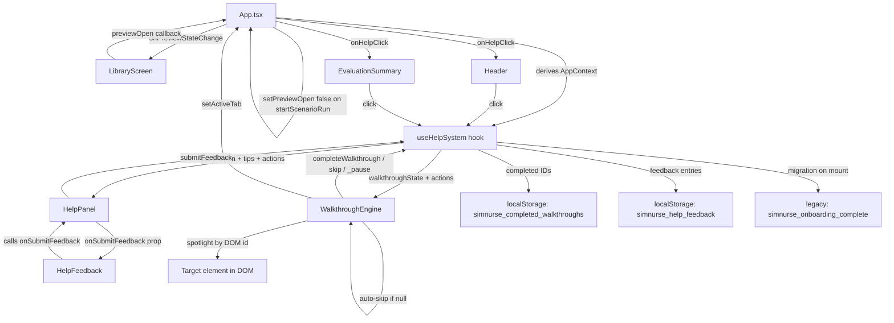

# Context-Aware Help System — Architecture Plan

> **Revision notes (v2)**
> - Feedback persistence changed from Dexie to `localStorage` only — no schema version bump needed.
> - Sixth context `preview_modal` added for the `ScenarioPreviewModal` inside `LibraryScreen`.
> - Plan reviewed against `Header.tsx`, `LibraryScreen.tsx`, `OnboardingTour.tsx`, `ProcedureGuide.tsx`, `App.tsx`.

> **Revision notes (v3 — Gap Review)**
> - 10 sequential implementation gaps identified and resolved. See "Gap Review (v3)" section below.
> - `EvaluationSummary.tsx` added to modified files (new `onHelpClick?` prop).
> - `HelpFeedback` no longer calls `useHelpSystem` directly — receives `onSubmitFeedback` prop instead.
> - `_pauseWalkthrough()` internal mechanism introduced; `skipWalkthrough()` / `completeWalkthrough()` semantics clarified.
> - localStorage one-time migration from legacy `simnurse_onboarding_complete` key documented.
> - `WalkthroughEngine` missing-target-skip behavior added.
> - `startScenarioRun` must call `setPreviewOpen(false)` explicitly.

---

## Gap Review (v3)

The following 10 issues were identified during final review of the v2 plan against source files and resolved inline throughout this document. This section serves as a quick reference index.

| # | Issue | Resolution | Section updated |
|---|---|---|---|
| 1 | `previewOpen` stuck `true` after `startScenarioRun` | `startScenarioRun` must call `setPreviewOpen(false)` | `App.tsx` modifications |
| 2 | Context change during active walkthrough unspecified | Add `useEffect` in `useHelpSystem` that calls `_pauseWalkthrough()` on context change mid-walkthrough | `useHelpSystem` |
| 3 | No `<Header>` in debrief branch — no help trigger | Add `onHelpClick?` prop to `EvaluationSummary`; render `?` icon button when provided | `EvaluationSummary.tsx` modifications |
| 4 | Welcome banner may be dismissed when library walkthrough step 1 targets it | `WalkthroughEngine` auto-skips steps whose `targetId` resolves to `null`; stable container IDs preferred | `WalkthroughEngine` |
| 5 | `HelpFeedback` cannot call `useHelpSystem(context)` without knowing context | `HelpFeedback` receives `onSubmitFeedback` prop; `HelpPanel` passes `helpSystem.submitFeedback` | `HelpFeedback`, `HelpPanel` |
| 6 | `startWalkthrough()` would bail on replay if completion guard is inside it | `startWalkthrough()` always starts; guard is only in auto-start debounce | `useHelpSystem` |
| 7 | `openPanel()` calling `skipWalkthrough()` is destructive | Replaced with `_pauseWalkthrough()` (no localStorage write); semantics of `skip`/`complete`/`_pause` clarified | `useHelpSystem` |
| 8 | Auto-start is a silent reversal of old opt-in behavior | "Behavioral change" callout added under `WalkthroughEngine` | `WalkthroughEngine` |
| 9 | `preview_modal` steps must never use `tab` field | Constraint added to `preview_modal` walkthrough content spec | `helpContent.ts` |
| 10 | Legacy `simnurse_onboarding_complete` key conflict | One-time migration on first mount of `useHelpSystem` | `useHelpSystem` |

---

## Overview

SimNurse currently has a minimal, opt-in [`OnboardingTour`](src/components/OnboardingTour.tsx) (3 fixed steps, DOM-spotlight) and a hardcoded help button in [`Header`](src/components/Header.tsx) that simply resets the tour. This plan replaces and extends that with a fully context-aware help system that:

1. Tracks the user's **current location** (6 contexts) and surfaces relevant guidance automatically.
2. Delivers **full walkthroughs** per context — the existing 3-step tour becomes multi-step flows tailored to each screen.
3. Surfaces a **contextual help panel** (slide-in drawer) with quick-tips, walkthrough launcher, and keyboard shortcuts.
4. Collects **thumbs-up/down + optional comment feedback** per help topic, persisted to `localStorage`.

---

## App Context Model

Six distinct locations each receive dedicated guidance:

| Context ID | When active | Key DOM targets to spotlight |
|---|---|---|
| `library` | `!activeScenario && !previewOpen` | Welcome banner, scenario cards, search bar, difficulty badges |
| `preview_modal` | `!activeScenario && previewOpen` | Case Preview modal header, initial vitals grid, `#begin-scenario-btn` |
| `patient` | `activeScenario && !showSummary && activeTab === 'patient'` | Urgency strip, patient illustration, narrative text, Finish Case button |
| `actions` | `activeScenario && !showSummary && activeTab === 'actions'` | Search bar, category chips, action cards, ProcedureGuide confirm button |
| `status` | `activeScenario && !showSummary && activeTab === 'status'` | VitalCard grid, unlock button, ECG waveform, `#progress-bar` |
| `debrief` | `showSummary === true` | ScoreGauge, action timeline, clinical conclusion, restart/library buttons |

---

## New Files

### 1. `src/data/helpContent.ts`

Static typed data powering the entire system. No runtime dependencies.

```ts
export type AppContext =
  | 'library'
  | 'preview_modal'
  | 'patient'
  | 'actions'
  | 'status'
  | 'debrief';

export interface HelpTip {
  id: string;           // unique — used as localStorage feedback key
  heading: string;
  body: string;
}

export interface WalkthroughStep {
  id: string;
  targetId: string;     // DOM element id to spotlight
  title: string;
  content: string;
  position: 'top' | 'bottom' | 'left' | 'right';
  tab?: string;         // switch tab before rendering this step
                        // ⚠️ NEVER set `tab` on preview_modal steps (see constraint below)
}

export interface ContextHelpContent {
  context: AppContext;
  walkthroughId: string;
  walkthroughTitle: string;
  steps: WalkthroughStep[];
  quickTips: HelpTip[];
}

export const HELP_CONTENT: Record<AppContext, ContextHelpContent>
```

Content matrix:

| Context | Walkthrough steps | Quick tips |
|---|---|---|
| `library` | 5 | 3 |
| `preview_modal` | 4 | 2 |
| `patient` | 6 | 4 |
| `actions` | 6 | 4 |
| `status` | 5 | 3 |
| `debrief` | 4 | 3 |

**`library` steps (5):** Welcome banner → scenario card → difficulty badge → search/filter bar → "tap a card to preview" nudge.

> **⚠️ Gap #4 — Step target stability:** Step 1 targets the welcome banner (`id="welcome-banner"`). Because the banner can be dismissed (`WELCOME_DISMISSED_KEY === 'true'`), the element may be absent from the DOM. Two mitigations apply:
> 1. `WalkthroughEngine` auto-skips any step whose `document.getElementById(step.targetId)` returns `null` (see `WalkthroughEngine` section).
> 2. The step should specify a stable fallback by targeting `id="scenario-list"` (the scenario list container) instead of the banner ID. If the welcome banner is guaranteed to be rendered as a permanent element (just conditionally hidden), a `data-help-id` attribute approach is preferable.
>
> **Rule:** `targetId` values in step definitions must correspond to elements that are **always present** in their context. Avoid targeting optional or conditionally rendered banners. Use stable container IDs instead.

**`preview_modal` steps (4):** Case preview header (title, patient identity) → initial vitals grid → difficulty/domain/duration badges → `#begin-scenario-btn` ("Begin Scenario" CTA).

> **⚠️ Gap #9 — `tab` field constraint:** `preview_modal` steps must **never** include a `tab` field. `setActiveTab` controls `patient`/`actions`/`status` tabs which are only present during an active scenario run. In `preview_modal` context, `LibraryScreen` is rendered, not the scenario tab layout. Any `tab` field on a `preview_modal` step would have no effect and indicates a data error.

**`patient` steps (6):** Urgency strip pills → patient illustration + narrative text → BottomNav "Actions" tab callout → BottomNav "Status" tab callout → Finish Case button → `#help-btn`.

**`actions` steps (6):** Search bar → category chip row → first action card → "long-press/tap for Procedure Guide" tip → rejection badge on BottomNav → "Reset Hidden Guides" option.

**`status` steps (5):** Vitals grid (locked state) → unlock action callout → ECG waveform → `#progress-bar` → scenario clock pill in Header.

**`debrief` steps (4):** Score gauge → action timeline (correct vs rejected) → clinical conclusion text → Restart vs Return to Library buttons.

---

### 2. `src/hooks/useHelpSystem.ts`

Central hook consumed by [`App.tsx`](src/App.tsx). Owns all mutable help state.

**Public interface:**

```ts
export interface HelpSystemState {
  context: AppContext;
  panelOpen: boolean;
  walkthroughActive: boolean;
  walkthroughId: string | null;
  walkthroughStepIndex: number;
  content: ContextHelpContent;  // derived from context
}

export interface HelpSystemActions {
  openPanel(): void;
  closePanel(): void;
  startWalkthrough(id?: string): void;  // defaults to context's walkthroughId
  nextStep(): void;
  prevStep(): void;
  completeWalkthrough(): void;
  skipWalkthrough(): void;
  wasWalkthroughCompleted(id: string): boolean;
  submitFeedback(topicId: string, rating: 'up' | 'down', comment?: string): void;
}

export function useHelpSystem(context: AppContext): HelpSystemState & HelpSystemActions
```

**Internal (non-exported) mechanism:**

```ts
// _pauseWalkthrough(): sets walkthroughActive = false WITHOUT writing to localStorage.
// Used by openPanel() for mutual exclusion without destroying walkthrough progress.
// Does NOT mark the walkthrough as skipped or completed.
function _pauseWalkthrough(): void
```

**Walkthrough state semantics (Gap #7):**

| Action | Sets `walkthroughActive` | Writes localStorage | Meaning |
|---|---|---|---|
| `startWalkthrough()` | `true` | No | Begin or resume from step 0 |
| `_pauseWalkthrough()` | `false` | No | Temporarily suspend (panel opened) |
| `skipWalkthrough()` | `false` | No | User explicitly dismissed mid-tour (does NOT mark complete) |
| `completeWalkthrough()` | `false` | Yes — adds ID to `simnurse_completed_walkthroughs` | All steps finished |

> **Note:** `skipWalkthrough()` does NOT write to localStorage. The walkthrough will auto-start again on the next context visit if not completed. This is intentional — "skip" means "not now", not "never show again". Only `completeWalkthrough()` permanently stamps the ID as seen.

**Mutual exclusion (Gap #7 — corrected):**

- `openPanel()` calls `_pauseWalkthrough()` first (NOT `skipWalkthrough()`). This suspends the tour without marking it skipped.
- `startWalkthrough()` calls `closePanel()` first.
- Closing the panel does NOT auto-resume the walkthrough. The user must click "Resume" explicitly in the panel or the next context-enter debounce fires.

**`startWalkthrough()` always starts (Gap #6):**

```ts
// startWalkthrough ALWAYS begins the walkthrough regardless of completion status.
// It is the CALLER's responsibility to check wasWalkthroughCompleted() before calling,
// if they wish to guard against replay. The Replay button in HelpPanel calls this
// unconditionally — that is the intended usage.
// The wasWalkthroughCompleted guard applies ONLY inside the auto-start debounce logic.
startWalkthrough(id?: string): void {
  const targetId = id ?? HELP_CONTENT[context].walkthroughId;
  closePanel();
  setState(s => ({ ...s, walkthroughActive: true, walkthroughId: targetId, walkthroughStepIndex: 0 }));
}
```

**Context-change walkthrough guard (Gap #2):**

```ts
useEffect(() => {
  // If a walkthrough is active and the context changes such that the
  // current walkthroughId no longer matches the new context's walkthroughId,
  // pause (not skip) the walkthrough to avoid rendering steps from the wrong context.
  if (walkthroughActive && walkthroughId !== HELP_CONTENT[context].walkthroughId) {
    _pauseWalkthrough();
  }
}, [context]);
```

**Auto-start logic (debounced):**

```
On context change in useEffect:
  id = HELP_CONTENT[context].walkthroughId
  if NOT wasWalkthroughCompleted(id):   ← guard applies HERE ONLY
    scheduleTimer(2000ms):
      if context still matches:
        startWalkthrough(id)

cleanup: cancel pending timer on unmount or next context change
```

**Persistence (localStorage only):**

| Key | Value | Purpose |
|---|---|---|
| `simnurse_completed_walkthroughs` | JSON `string[]` | Which walkthrough IDs are done |
| `simnurse_help_feedback` | JSON `FeedbackEntry[]` | All submitted feedback entries |

`FeedbackEntry`:
```ts
interface FeedbackEntry {
  topicId: string;
  context: AppContext;
  rating: 'up' | 'down';
  comment?: string;
  timestamp: number;
}
```

**One-time localStorage migration (Gap #10):**

The legacy [`OnboardingTour`](src/components/OnboardingTour.tsx) writes `simnurse_onboarding_complete = 'true'` when the user finishes the 3-step tour. The new system uses `simnurse_completed_walkthroughs` (JSON array). To avoid showing the library tour again to users who already completed the old tour:

```ts
// On first mount of useHelpSystem (run once via useEffect with [] deps):
useEffect(() => {
  const legacyKey = 'simnurse_onboarding_complete';
  if (localStorage.getItem(legacyKey) === 'true') {
    const existing: string[] = JSON.parse(
      localStorage.getItem('simnurse_completed_walkthroughs') ?? '[]'
    );
    if (!existing.includes('library-tour')) {
      existing.push('library-tour');
      localStorage.setItem('simnurse_completed_walkthroughs', JSON.stringify(existing));
    }
    // Do NOT remove the legacy key — it may be read by other legacy code.
  }
}, []);
```

> **Note:** `handleHelpClick` in `App.tsx` currently calls `localStorage.removeItem('simnurse_onboarding_complete')` and `localStorage.removeItem('simnurse_welcome_dismissed')`. These calls will be removed as part of Gap #10 cleanup. The new `openPanel()` must NOT touch those legacy keys.

---

### 3. `src/components/WalkthroughEngine.tsx`

Replaces [`OnboardingTour.tsx`](src/components/OnboardingTour.tsx) entirely.

**Props:**

```ts
interface WalkthroughEngineProps {
  helpSystem: HelpSystemState & HelpSystemActions;
  setActiveTab: (tab: string) => void;
}
```

> **⚠️ Behavioral change from old `OnboardingTour` (Gap #8):**
>
> **Breaking from old `OnboardingTour` behavior:** The tour now **auto-starts after a 2-second debounce** on first context visit (i.e., when `wasWalkthroughCompleted(id) === false`). This is **intentional** — the old opt-in model (controlled entirely by `handleHelpClick` resetting `tourKey`) left most users unaware of available guidance. The 2-second delay ensures the UI is fully settled before the overlay appears. Users can still skip or dismiss at any time via the "Skip" button or `Escape` key.
>
> If reverting to opt-in behavior is desired, remove the auto-start `useEffect` timer from `useHelpSystem` and rely solely on `startWalkthrough()` being called from `HelpPanel`.

**Missing target element handling (Gap #4):**

`WalkthroughEngine` must handle the case where a step's `targetId` does not resolve to a DOM element:

```ts
// On rendering each step (or on advancing to a step):
const targetEl = document.getElementById(currentStep.targetId);
if (targetEl === null) {
  // Auto-skip this step — call nextStep() internally.
  // Do NOT render an invisible or stuck tooltip.
  helpSystem.nextStep();
  return null; // render nothing for this frame
}
```

This prevents the tour from silently stalling on steps that target conditionally rendered elements (e.g., the welcome banner after dismissal).

**Differences from old `OnboardingTour`:**

| Feature | Old `OnboardingTour` | New `WalkthroughEngine` |
|---|---|---|
| Step count | 3 fixed global steps | Per-context steps (4–6) |
| Back navigation | ✗ | ✓ Previous button |
| Progress indicator | "Step N of M" text | Dot row (one per step) |
| Auto-start | Opt-in only (key-triggered) | Auto-starts after 2 s on first context visit |
| Completion badge | ✗ | Triggers `completeWalkthrough()` which stamps localStorage |
| Keyboard nav | ✗ | `→` / `←` arrow keys, `Escape` to skip |
| Missing target | Returns null (stuck tour) | Auto-skips step via `nextStep()` |

Rendering: same four-panel overlay technique as existing component. Z-index `z-[999]`.

---

### 4. `src/components/HelpPanel.tsx`

Slide-in bottom drawer — same portal/animation pattern as [`ProcedureGuide.tsx`](src/components/ProcedureGuide.tsx). Z-index `z-[200]` (well below the walkthrough overlay). Renders via `createPortal(…, document.body)`.

**Props:**

```ts
interface HelpPanelProps {
  helpSystem: HelpSystemState & HelpSystemActions;
}
```

**Panel sections:**

1. **Context label** — e.g. "Help: Actions Screen" — auto-updates when context changes (panel re-renders with new content).
2. **Walkthrough CTA** — "Start Walkthrough" button. Shows "Resume" if walkthrough was paused (`walkthroughActive === false` but `walkthroughId` matches context and `walkthroughStepIndex > 0`). Shows a ✓ completed badge with a "Replay" option if previously completed. Clicking "Replay" calls `helpSystem.startWalkthrough()` unconditionally (Gap #6 — no completion guard in `startWalkthrough` itself).
3. **Quick Tips accordion** — one collapsible row per `HelpTip`. Each expanded tip shows body text + [`HelpFeedback`](src/components/HelpFeedback.tsx) widget at its bottom.
   - `HelpPanel` passes `onSubmitFeedback={helpSystem.submitFeedback}` to each `HelpFeedback` instance (Gap #5).
4. **Keyboard shortcuts** (desktop only) — shown when `window.matchMedia('(pointer: coarse)').matches === false`. A compact table of app shortcuts.

---

### 5. `src/components/HelpFeedback.tsx`

Inline feedback widget attached to each `HelpTip` in the panel and to the WalkthroughEngine completion screen.

**Props (Gap #5 — corrected):**

```ts
interface HelpFeedbackProps {
  tipId: string;
  onSubmitFeedback: (topicId: string, rating: 'up' | 'down', comment?: string) => void;
}
```

> **Gap #5 fix:** `HelpFeedback` does NOT call `useHelpSystem` directly. `useHelpSystem(context)` requires a `context: AppContext` argument that `HelpFeedback` has no way to know without prop drilling or a React Context. Instead, `HelpPanel` passes `helpSystem.submitFeedback` down as the `onSubmitFeedback` prop. This keeps `HelpFeedback` a pure presentation component with no hook dependencies.

**States:**

1. **Idle** — two ghost icon buttons: 👍 / 👎.
2. **Rated** — selected icon fills; optional `<textarea>` slides in with "Tell us more (optional)" placeholder + "Submit" button.
3. **Submitted** — confirmation text "Thanks for your feedback!" replaces the form.

State is fully local. Calls `onSubmitFeedback(tipId, rating, comment)` on Submit (or immediately on rating click if no comment is entered within 3 s — timeout-based auto-submit).

---

## Modified Files

### `src/App.tsx`

**Changes:**

1. Add `previewOpen` state (boolean) that `LibraryScreen` writes to via a new `onPreviewStateChange` prop callback.
2. Derive `context: AppContext` with `useMemo`:
   ```ts
   const context = useMemo<AppContext>(() => {
     if (!activeScenario && previewOpen) return 'preview_modal';
     if (!activeScenario) return 'library';
     if (showSummary) return 'debrief';
     if (activeTab === 'actions') return 'actions';
     if (activeTab === 'status') return 'status';
     return 'patient';
   }, [activeScenario, previewOpen, showSummary, activeTab]);
   ```
3. Call `useHelpSystem(context)` and bind its return value to `helpSystem`.
4. Replace `<OnboardingTour key={tourKey} …>` → `<WalkthroughEngine helpSystem={helpSystem} setActiveTab={setActiveTab} />`.
5. Add `<HelpPanel helpSystem={helpSystem} />` in all three render branches.
6. Remove `tourKey` state.
7. Remove the manual `localStorage.removeItem('simnurse_onboarding_complete')` and `localStorage.removeItem('simnurse_welcome_dismissed')` calls from `handleHelpClick` — these are legacy-only and must not be called by the new system (Gap #10).
8. Change `handleHelpClick` to call `helpSystem.openPanel()`.
9. Pass `onHelpClick={() => helpSystem.openPanel()}` and `walkthroughCompleted={helpSystem.wasWalkthroughCompleted(helpSystem.content.walkthroughId)}` to `<Header>`.
10. **Gap #3:** Pass `onHelpClick={() => helpSystem.openPanel()}` to `<EvaluationSummary>` in the debrief render branch (see `EvaluationSummary.tsx` section below).
11. **Gap #1 — `setPreviewOpen(false)` in `startScenarioRun`:**
    ```ts
    function startScenarioRun(scenario: Scenario) {
      setPreviewOpen(false);   // ← MUST be called explicitly before LibraryScreen unmounts
      setActiveScenario(scenario);
      // ... rest of existing logic
    }
    ```
    > **Rationale:** When the user clicks "Begin Scenario" inside the preview modal, `LibraryScreen` unmounts immediately. The `onPreviewStateChange(false)` callback inside `LibraryScreen` may not fire before unmount. Without this explicit reset, `previewOpen` stays `true` in `App.tsx` state even after the scenario starts, causing `context` to incorrectly resolve to `'preview_modal'` instead of `'patient'`.

### `src/components/Header.tsx`

**Changes:**

1. Add `walkthroughCompleted?: boolean` to `HeaderProps`.
2. When `walkthroughCompleted === false`, render a small amber pulsing dot badge overlaid on `#help-btn` — a subtle nudge that a tour is available.
3. Update `title` / `aria-label` from "Restart onboarding tour" → "Open Help".

### `src/components/LibraryScreen.tsx`

**Changes:**

1. Add `onPreviewStateChange?: (isOpen: boolean) => void` to `LibraryScreenProps`.
2. Call `onPreviewStateChange(true)` when `setPreviewScenario(scenario)` is called.
3. Call `onPreviewStateChange(false)` when the modal is cancelled or confirmed (note: `startScenarioRun` in `App.tsx` also resets this independently as a safety guard — see Gap #1).

> Why: The `previewScenario` state lives inside `LibraryScreen`. Lifting it to `App` would be a larger refactor. A callback is the minimal surface needed.

### `src/components/EvaluationSummary.tsx` *(new modification — Gap #3)*

**Problem:** The debrief render branch in `App.tsx` renders only `<EvaluationSummary …/>` with no `<Header>`. There is no `#help-btn` in the DOM during debrief. Without a help trigger, users in the debrief context cannot open `HelpPanel`.

**Changes:**

1. Add `onHelpClick?: () => void` to `EvaluationSummaryProps`.
2. When `onHelpClick` is provided, render a small `?` icon button in the `EvaluationSummary` header row (top-right corner, consistent with the app's help button styling).
3. The button calls `onHelpClick()` on press.
4. When `onHelpClick` is not provided (e.g. in tests or Storybook), the button is not rendered — the prop is fully optional.

```ts
interface EvaluationSummaryProps {
  // ... existing props ...
  onHelpClick?: () => void;  // ← new
}
```

---

## Data Flow Diagram



---

## Context Detection — Full Truth Table

```
activeScenario=null, previewOpen=false  →  'library'
activeScenario=null, previewOpen=true   →  'preview_modal'
activeScenario≠null, showSummary=true  →  'debrief'
activeScenario≠null, tab='actions'     →  'actions'
activeScenario≠null, tab='status'      →  'status'
activeScenario≠null, tab='patient'     →  'patient'  (default)
```

**Important:** `previewOpen` in `App.tsx` must be explicitly reset to `false` in `startScenarioRun` before `setActiveScenario` is called. Do not rely solely on the `LibraryScreen` unmount callback (see Gap #1).

---

## Feedback Schema (localStorage)

```ts
// key: 'simnurse_help_feedback'
// value: JSON.stringify(FeedbackEntry[])

interface FeedbackEntry {
  topicId: string;      // HelpTip.id or `${walkthroughId}__complete`
  context: AppContext;
  rating: 'up' | 'down';
  comment?: string;
  timestamp: number;    // Date.now()
}
```

Max 200 entries stored. On overflow (> 200), the oldest 50 are dropped before writing.

---

## Test Plan

### Vitest unit tests — `src/hooks/useHelpSystem.test.ts`

- `startWalkthrough` sets `walkthroughActive: true`, `walkthroughStepIndex: 0`.
- `startWalkthrough` called after `completeWalkthrough` still starts (replay path — Gap #6).
- `nextStep` increments index; no-op at last step.
- `prevStep` decrements index; no-op at index 0.
- `completeWalkthrough` sets `walkthroughActive: false`; writes to `localStorage`.
- `skipWalkthrough` sets `walkthroughActive: false`; does NOT write to `localStorage` (Gap #7).
- `_pauseWalkthrough` (internal) sets `walkthroughActive: false`; does NOT write to `localStorage` (Gap #7).
- `openPanel` calls `_pauseWalkthrough` — walkthrough step index is preserved, `localStorage` unchanged (Gap #7).
- `wasWalkthroughCompleted` reads `localStorage` correctly.
- `submitFeedback` appends entry, respects 200-entry cap.
- Context change while walkthrough active: `walkthroughActive` becomes `false`, step index preserved (Gap #2).
- Auto-start fires after 2 s when walkthrough not completed (use fake timers).
- Auto-start does NOT fire if `wasWalkthroughCompleted` returns `true` (Gap #6).
- Migration: if `simnurse_onboarding_complete === 'true'` on mount, `library-tour` is written to `simnurse_completed_walkthroughs` (Gap #10).

### Playwright smoke test — `tests/help-system.spec.ts`

1. Load app → library context.
2. Wait 2.5 s → `WalkthroughEngine` tooltip visible.
3. Click "Next" N times until last step → click "Got it" → tooltip gone.
4. Click `#help-btn` → `HelpPanel` opens.
5. Expand first quick tip → `HelpFeedback` widget visible.
6. Click 👍 → text area appears → type comment → click Submit → confirmation text visible.
7. Click "Replay Walkthrough" in panel → `WalkthroughEngine` re-opens (Gap #6 — completed walkthrough replays).
8. Press `Escape` → tour dismissed.
9. Begin a scenario → navigate to debrief → no `<Header>` rendered → `EvaluationSummary` `?` button visible → click → `HelpPanel` opens (Gap #3).

---

## File Summary

| File | Action | Notes |
|---|---|---|
| [`src/data/helpContent.ts`](src/data/helpContent.ts) | **Create** | Static data for 6 contexts |
| [`src/hooks/useHelpSystem.ts`](src/hooks/useHelpSystem.ts) | **Create** | Central state hook with `_pauseWalkthrough`, migration, context-change guard |
| [`src/components/WalkthroughEngine.tsx`](src/components/WalkthroughEngine.tsx) | **Create** | Replaces `OnboardingTour`; auto-skips null-target steps |
| [`src/components/HelpPanel.tsx`](src/components/HelpPanel.tsx) | **Create** | Slide-in contextual drawer; passes `submitFeedback` to `HelpFeedback` |
| [`src/components/HelpFeedback.tsx`](src/components/HelpFeedback.tsx) | **Create** | Inline thumbs feedback widget; receives `onSubmitFeedback` prop |
| [`src/hooks/useHelpSystem.test.ts`](src/hooks/useHelpSystem.test.ts) | **Create** | Vitest unit tests |
| [`tests/help-system.spec.ts`](tests/help-system.spec.ts) | **Create** | Playwright smoke tests |
| [`src/App.tsx`](src/App.tsx) | **Modify** | Context derivation + `previewOpen` state + `setPreviewOpen(false)` in `startScenarioRun` + new component wiring |
| [`src/components/Header.tsx`](src/components/Header.tsx) | **Modify** | `walkthroughCompleted` badge + updated aria-label |
| [`src/components/LibraryScreen.tsx`](src/components/LibraryScreen.tsx) | **Modify** | `onPreviewStateChange` callback |
| [`src/components/EvaluationSummary.tsx`](src/components/EvaluationSummary.tsx) | **Modify** | New `onHelpClick?` prop + `?` icon button in header row |
| [`src/lib/db.ts`](src/lib/db.ts) | **No change** | Feedback uses localStorage; no Dexie schema bump needed |
| [`src/components/OnboardingTour.tsx`](src/components/OnboardingTour.tsx) | **Delete** | Superseded by `WalkthroughEngine` |
